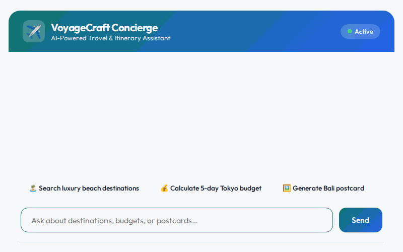

# VoyageCraft Concierge

> An AI-powered travel concierge agent that helps users discover destinations, plan personalized itineraries, calculate itemized trip budgets, and generate visual postcards and video previews.



---

## Capabilities & Implemented Tools

VoyageCraft Concierge is built using the Google ADK (Agent Development Kit) framework and implements the following core tools and features:

- **Destination Catalog Search (`search_destinations`)**: Searches the Firestore `destinations` database by keyword, budget tier (`budget`, `moderate`, `luxury`), or descriptive tags (`coastal`, `culture`, `beach`, `temples`).
- **Destination Details (`get_destination_details`)**: Retrieves full records and activity recommendations for specific destinations from Firestore by ID.
- **Add Destination (`add_destination`)**: Writes new destination entries and recommended activities into the Firestore database.
- **Itemized Budget Calculator (`calculate_trip_budget`)**: Computes itemized travel cost breakdowns for flights, lodging, meals, activities, and transit, along with per-person estimates.
- **Real-Time Exchange Rates (`get_exchange_rate`)**: Fetches live foreign exchange rates between base and target currencies via public currency APIs.
- **Postcard Image Generation (`generate_destination_postcard`)**: Generates travel postcard images using `gemini-3.1-flash-lite-image`, saves them as session artifacts, and uploads the image bytes directly to a public Cloud Storage bucket.
- **Video Preview Generation (`generate_destination_preview_video`)**: Generates short travel video previews using Google's Omni model (`gemini-omni-flash-preview`) in the `global` region, saves them as session artifacts, and uploads the video bytes directly to Cloud Storage.
- **Weather & Time Tools (`get_weather`, `get_current_time`)**: Provides time zone checks and weather summaries for requested cities.
- **Cross-Session Memory (`PreloadMemoryTool` & Memory Bank Callback)**: Automatically extracts and remembers user favorite destinations, travel style preferences, and budget constraints across chat turns using Vertex AI Memory Bank.
- **Dynamic A2UI Rendering (`A2uiSchemaManager` v0.8)**: Generates structured, responsive UI cards and layouts rendered cleanly in the web chat interface.

---

## Google Cloud Services Integrated

1. **Vertex AI Agent Engine / Reasoning Engine**: Runtime deployment platform for agent execution and sandbox code execution.
2. **Vertex AI Memory Bank**: Long-term cross-session memory storage for traveler preferences and saved choices.
3. **Cloud Firestore**: Database for storing and querying destination records and recommendations.
4. **Cloud Storage (GCS)**: Storage bucket (`voyagecraft-assets-1069236132412`) for generated image postcards and MP4 video previews.
5. **Vertex AI Generative Media Models**:
   - `gemini-3.1-flash-lite-image` for postcard image generation.
   - `gemini-omni-flash-preview` (via Interactions API) for travel video previews.

---

## Project Structure

```
voyagecraft-concierge/
├── app/
│   ├── agent.py            # Main ADK Agent definition, memory callbacks, and A2UI instruction setup
│   ├── tools.py            # Firestore, GCS, Memory, Budget, Exchange Rate, Image & Video tools
│   ├── a2ui_utils.py       # A2UI after_model_callback transformer
│   └── fast_api_app.py     # FastAPI application wrapper for ADK agent
├── frontend/
│   ├── main.py             # FastAPI proxy connecting web interface to agent via A2A protocol
│   ├── Procfile            # Uvicorn server configuration for Cloud Run
│   ├── requirements.txt    # Python dependencies for the frontend proxy
│   └── static/
│       └── index.html      # Rebranded frontend UI with prompt chips and dialogue layout
├── agents-cli-manifest.yaml# Manifest specifying agent configuration and deployment targets
├── demo.gif                # Looping demo recording of the web interface
└── README.md               # Project documentation
```

---

## Local Setup & Execution

### Prerequisites

- Python 3.10+
- Google Cloud SDK (`gcloud`) authenticated with access to Vertex AI, Firestore, and Cloud Storage.

### 1. Install Dependencies

```bash
pip install -r frontend/requirements.txt
```

### 2. Set Environment Variables

```bash
export AGENT_ENGINE_RESOURCE_NAME="projects/<PROJECT_NUMBER>/locations/us-central1/reasoningEngines/<REASONING_ENGINE_ID>"
export AGENT_DIRECTORY="app"
```

### 3. Start Frontend Server

Run the proxy server from the project directory:

```bash
uvicorn frontend.main:app --host 0.0.0.0 --port 8080
```

Open your web browser and navigate to the application port to interact with VoyageCraft Concierge!
